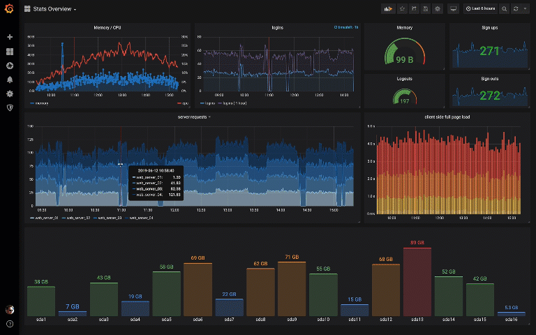
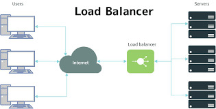
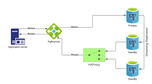

# Escalando aplicações WEB
Levantamento de alguns pontos para se analisar para aumentar a performance da sua aplicação web.

- [x] Balanceando Carga - Multi-processos e Proxy Reverso
- [x] Pool de Conexões - Calculando Uso de Recursos
- [x] Estratégia de Caching - Economizando Recursos
- [x] Replicas - Bancos de Dados - Diferenças e quando usar
- [x] Jobs Assíncronos - Devolvendo Rápido
- [x] CDN - Assets mais Rápidos

## Para a identificação muito desses pontos.
- [x] Observabilidade - Calculadoras e Monitores
 
- Monitoramento das aplicações para identificar pontos de gargalos, como páginas com muitos
  acessos que podem ser cacheados, tráfego lento em certas request, querys lentas, etc ...
  Por exemplo, use um Elasticsearch com Grafana para visualizar essas informações.
   
  <h1 align="center">
  
  </h1>

## Princípios para escalonar aplicações WEB:

- Certifique-se de que o seu framework está aproveitando os núcleos do seu servidor.
  Linguagens de script como Javascript, PHP, Python e Ruby, são feitos pra rodar primariamente 
  em um thread só. Caso ele rode apenas em um núcleo por vez, crie mais instâncias, afim 
  de aproveitar a quantidade desejada de núcleos de processamento.
  

- Faça um load balance entre as instâncias da sua aplicação em seu servidor web.
  <h1 align="center">
  
  </h1>
  
- Deixei seu servidor web cuidando das requisições dos arquivos estáticos.

- Use servidores CDN para armazenar seus arquivos estáticos e evitar consultas 
  desnecessárias ao seu servidor. Servidores CDN tendem a ser mais performáticos ao 
  entregarem esses arquivos e ainda estão em várias zonas de disponibilidade para encurtar
  a rota ao cliente.

- Utilize cache nas áreas mais estratégicas. Em home, em páginas mais acessadas,
  por usuário.

- Utilize de processamento asíncrono como sistemas de filas, Kafka, rabbitmq.
  Com alerta para o cliente usando emails, websocket, etc ...

### BANCO DE DADOS:

- Gerenciamento de requisições para o banco, pode usar uma interface pool de conexões. 
  ex: pgbouncer.
  <h1 align="center">
  
  </h1>
- Otimize suas querys nos banco de dados.
- Crie réplicas do banco apenas para leitura.
- Entenda a natureza da sua informação e atividade para saber qual os requisitos do
  para escolher o banco de dados que melhor desempenhe para sua situação.

### Referências:
 - https://www.youtube.com/watch?v=KyqFXVVgvIs
 - https://www.businessofapps.com/insights/what-are-scalable-web-applications-and-how-they-work/
